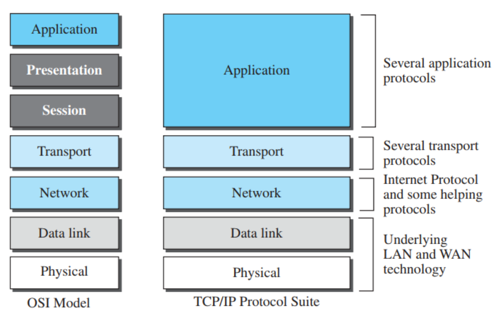

# Application Layer (TCP/IP)

The application layer in the TCP/IP protocol suite is a combination of three layers in the OSI model: [application layer](application-layer-osi.md), [presentation layer](presentation-layer.md), and [session layer](session-layer.md). In the TCP/IP model, these three layers are consolidated into a single application layer, providing services that directly interact with the end user.

## Compared with OSI Model

The TCP/IP model simplifies communication by merging these layers. This streamlined approach focuses on the essential aspects of network communication, allowing applications to manage tasks related to data formatting, encryption, and session management. 

Unlike the OSI model, which separates these tasks into distinct layers, the TCP/IP model reflects a more practical approach. Applications in the TCP/IP suite can handle these functions as needed, offering flexibility and efficiency for modern internet protocols.

### Functionalities

1. **Data Formatting**: In the OSI model, the [presentation layer](presentation-layer.md) handles the translation of data into a format that can be understood by different systems (e.g., encoding data in ASCII, EBCDIC, or encryption). In the TCP/IP model, this responsibility is integrated into the application layer. Applications can choose to implement their own data formatting techniques as needed, which reduces complexity at the model level.
2. **Encryption**: Security and encryption functionalities, traditionally handled by the [presentation layer](presentation-layer.md), are managed by application layer protocols in the TCP/IP model. For example, HTTPS provides encryption for web communication using SSL/TLS without the need for a separate encryption layer.
3. **Session Management**: The [session layer](session-layer.md) in the OSI model is responsible for managing sessions between applications. However, in the TCP/IP model, some transport layer protocols (such as TCP) inherently provide session-like functionality, such as establishing and maintaining connections between devices. This reduces the need for a separate session layer, allowing the application layer to focus on higher-level tasks.

### Example Protocols

Protocols operating at the application layer in the TCP/IP model handle specific tasks directly related to user interaction, such as:

- **HTTP/HTTPS**: Handles web browsing and secure web communication.
- **FTP**: Facilitates file transfers between systems.
- **SMTP**: Manages sending and receiving email.
- **DNS**: Translates domain names into IP addresses.

By combining the responsibilities of the OSI model's top three layers, the TCP/IP application layer allows for more flexibility and efficiency in network communication.
