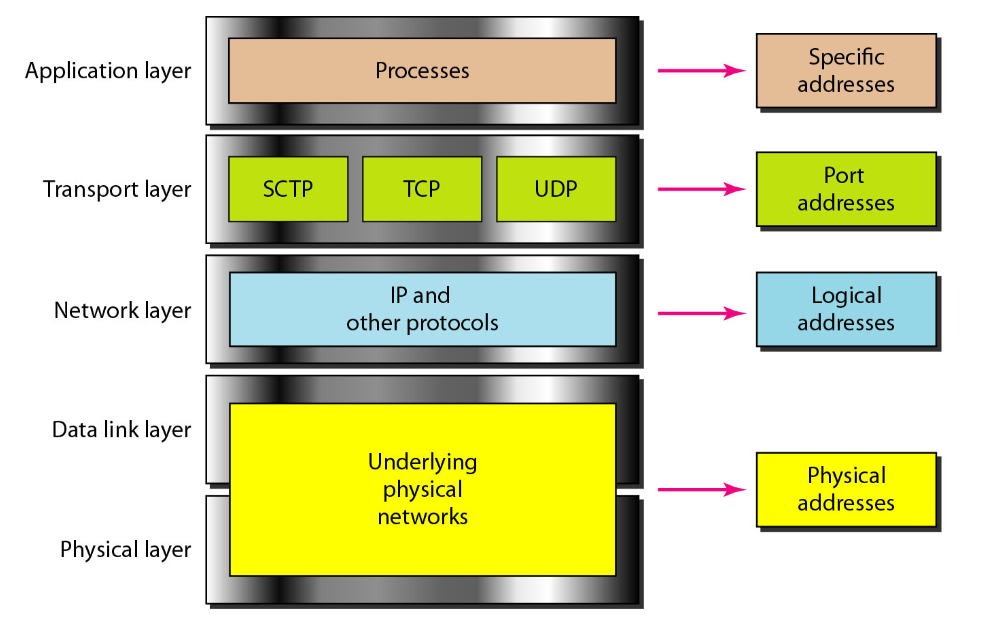

# Computer Network

A computer network is a set of computers sharing resources located on or provided by network nodes.

Computers use common communication protocols over digital interconnections to communicate with each other. These interconnections are made up of telecommunication network technologies based on physically wired, optical, and wireless radio-frequency methods

## Network Architecture

Network architecture is the design of a computer network. It is a framework for the specification of a network's physical components and their functional organisation and configuration, its operational principles and procedures, as well as communication protocols used.

- [OSI Model](osi-model.md)
- [TCP/IP Model](internet-protocol-suite.md)

## Addressing

Four levels of addresses are used in an internet employing the [TCP/IP protocols](internet-protocol-suite.md): [physical](physical-address.md), [logical](logical-address.md), [port](port-address.md), and [specific](specific-address.md).

