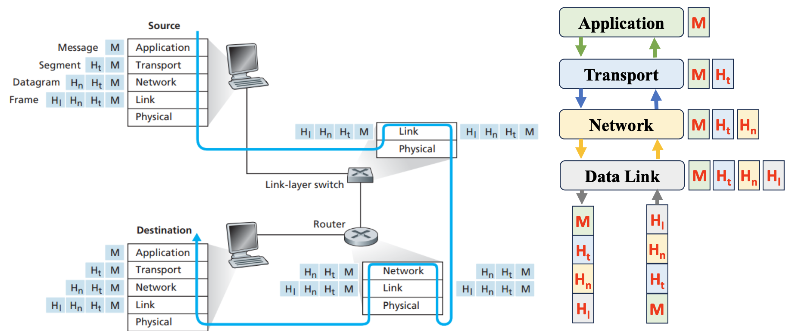

# Data Encapsulation in Layers

Data encapsulation is a fundamental concept in network communication where each layer of a protocol stack adds its own information to the data as it passes through the layers. This ensures that the data can be properly transmitted and interpreted by the receiving device.

## How Encapsulation Works

Encapsulation occurs at each layer of the protocol stack. Each layer in the sending device adds its own specific header (and sometimes trailer) to the data it receives from the layer above it. This header contains control information needed to deliver the message across the network. The process continues layer by layer until the data reaches the physical layer, where it is transmitted as electrical signals or bits over the network medium.

At the receiving end, the process is reversed. The message is passed up the protocol stack, and each layer removes the header added by its counterpart on the sending side. This "decapsulation" process continues until the original message is restored and handed to the receiving application.

### Encapsulation Process

In the following process, [TCP/IP](internet-protocol-suite.md) layer architecture is used.

1. **Application Layer**: The message is created at the application layer and passed down to the transport layer.
2. **Transport Layer**: The transport layer adds its own header (e.g., for TCP or UDP), which includes information such as source and destination port numbers, ensuring that the data reaches the correct application on the receiving device.
3. **Network Layer**: The network layer adds its own header, typically including source and destination IP addresses. This layer is responsible for routing the data across different networks.
4. **Data Link Layer**: The data link layer adds a frame header (and sometimes a trailer) to manage communication over a specific link, ensuring that data is properly formatted and transmitted over the physical medium.
5. **Physical Layer**: The physical layer converts the encapsulated data into bits and transmits them over the network medium as electrical or optical signals.

### Decapsulation Process

On the receiving side, the process is reversed:

1. The physical layer receives the raw bits and passes them to the data link layer.
2. The data link layer processes and removes the frame header and trailer, then passes the remaining data to the network layer.
3. The network layer removes its header, leaving the transport layer data, which is then passed up.
4. The transport layer removes its header, handing over the original message to the application layer.
5. The application layer receives the message and delivers it to the user or the application.

## Interfaces Between Layers

Each layer defines an interface that specifies the services it provides to the layer above it. These interfaces ensure that each layer can operate independently of the others, with each layer only needing to know how to communicate with the layer directly above or below it. The encapsulation and decapsulation process allows each layer to add or remove the necessary control information while keeping the actual data intact.