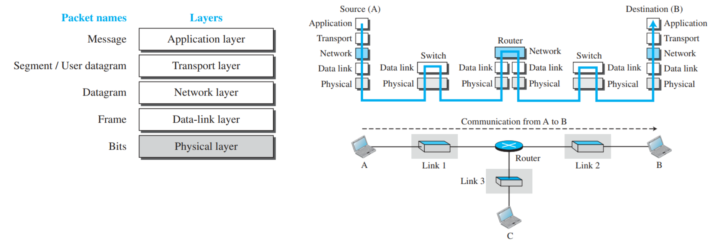

# Internet Protocol Suite (TCP/IP Model)

The Internet protocol suite, commonly known as TCP/IP, is a framework for organising the set of communication protocols used in the Internet and similar computer networks according to functional criteria.

## History

The TCP/IP model was developed by the U.S. Department of Defense (DoD) to interconnect various networks and ensure the integrity of data.

The TCP/IP protocol model was developed after the [OSI](osi-model.md) model, and it features a different number of layers compared to the OSI model.

## Layered Architecture

TCP/IP Protocol Suite was developed prior to the [OSI](osi-model.md). Their layers do not match.

[Encapsulation](data-encapsulation-in-layers.md) is key to ensuring that data is correctly transmitted, routed, and delivered across a network.

- **Encapsulation**: Each layer of the sending device adds a header to the data as it passes down the stack.
- **Decapsulation**: Each layer of the receiving device removes its corresponding header as the data passes up the stack.

### Application Layer

The [application layer](application-layer-tcp-ip.md) is the topmost layer where users interact with network services. This layer facilitates communication between applications on different computers, handling services such as file transfers, email, and web browsing.

The application layer in the TCP/IP protocol suite is a combination of three layers in the OSI model: [application layer](application-layer-osi.md), [presentation layer](presentation-layer.md) and [session layer](session-layer.md).

- **Examples**: Telnet, HTTP, FTP, WWW browsers
- **Responsibilities**: Providing user-level services.

### Transport Layer

The [transport layer](transport-layer.md) ensures the reliable transmission of data between two hosts. It divides large data streams into smaller packets and provides error checking and flow control.

- **Examples**: TCP, UDP
- **Responsibilities**: End-to-end delivery, flow control, error correction.

### Network Layer

The [network layer](network-layer.md) is responsible for the logical addressing and routing of data, this layer ensures that packets are transmitted across different networks and arrive at their correct destination.

- **Examples**: IP, IPX
- **Responsibilities**: Packet forwarding, routing

### Data Link Layer

The [data link layer](data-link-layer.md) ensures error-free data transfer between two devices connected on the same physical medium. It breaks down packets into frames and handles issues like flow control and error detection.

- **Examples**: Ethernet, Token Ring, Frame Relay
- **Responsibilities**: Framing, physical addressing, error detection.

### Physical Layer

The [physical layer](physical-layer.md) deals with the actual hardware connections and defines the electrical and physical aspects of the data transmission process, such as cable types, signal voltages, and bit rates.

- **Examples**: RJ45, Ethernet cables
- **Responsibilities**: Transmitting bits over the physical medium.