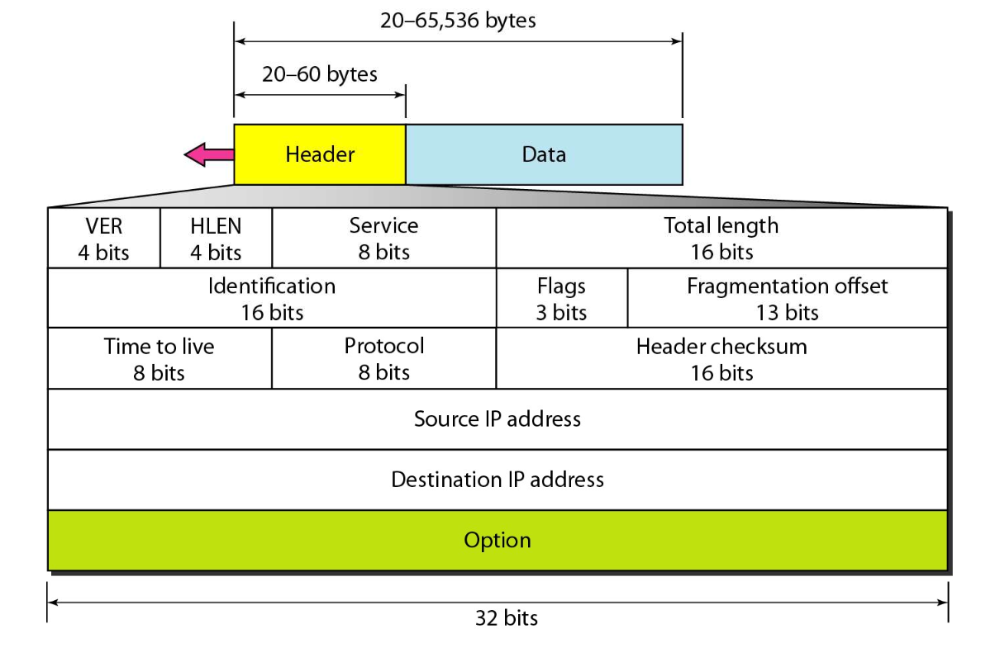
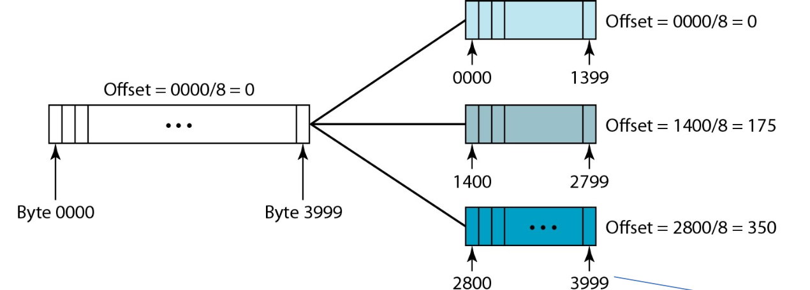
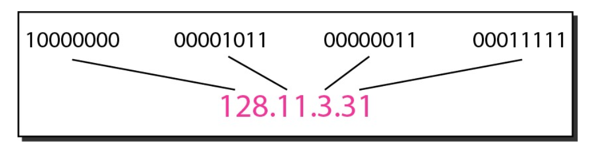

# IPv4

The Internet Protocol version 4 (IPv4) is the delivery mechanism used by the TCP/IP protocol suite. IPv4 provides a way to address and route packets of data across networks.

## Datagram Format

An IPv4 datagram is composed of a fixed 20-byte header followed by the data payload. The header contains several fields, each with specific purposes for routing and delivering the packet.

### IP Header Fields

The IPv4 header provides the necessary information for routing and handling the packet as it traverses the network, ensuring it reaches its intended destination.

1. **Version**: Indicates the version of the IP protocol. For IPv4, this field is set to `4`.
2. **Header Length (HLEN)**: Specifies the length of the IP header in 4-byte units. It helps determine where the header ends and the data begins. The minimum value is `5` (20 bytes), and the maximum is `15` (60 bytes).
3. **Type of Service (ToS)**: Used to indicate the priority and type of service requested for the packet. It helps routers make decisions about how to handle the packet (e.g., prioritising certain types of traffic).
4. **Total Length**: Represents the total length of the datagram, including the header and data, in bytes. This field allows the receiver to know the size of the entire packet.
5. **Identification**: A unique identifier used to differentiate fragments of a datagram when it is divided during transmission. All fragments of the same datagram will have the same Identification value.
6. **Flags**: Used to control fragmentation:
7. **Fragmentation Offset**: Indicates the position of a fragment within the original datagram. It is used to reassemble fragments in the correct order.
8. **Time-to-Live (TTL)**: Specifies the maximum number of hops (routers) the datagram can pass through before being discarded. It prevents packets from circulating indefinitely in the network.
9. **Protocol**: Defines the upper-layer protocol encapsulated within the IP datagram (e.g., TCP, UDP). This field tells the receiving host which protocol should handle the data.
10. **Header Checksum**: A checksum for error-checking the header to ensure its integrity. It helps detect any errors that may have occurred during transmission.
11. **Source Address**: The 32-bit IP address of the sender. This field identifies the origin of the datagram.
12. **Destination Address**: The 32-bit IP address of the intended recipient. This field specifies where the datagram is supposed to be delivered.
13. **Options**: An optional field used for various purposes, such as routing, time-stamping, and security. The options field is variable in length and not always present.

### Data Field

>[!NOTE]
>By using the MTU and fragmentation mechanism, IPv4 ensures that large packets can be transmitted across networks with varying maximum sizes, allowing for efficient and reliable data delivery.

#### Maximum Transfer Unit (MTU)

The Maximum Transfer Unit (MTU) refers to the largest size of a Layer 3 packet (or datagram) that can be transmitted over a specific network interface without requiring fragmentation.

- **MTU Definition**: It defines the largest size of a packet that a network interface can handle. If a packet is larger than the MTU of the interface, it must be fragmented.
- **Data Link Layer Protocol**: The MTU is influenced by the data link layer protocol being used. For instance, Ethernet frames typically have a default MTU of 1500 bytes.
- **Ethernet MTU**: The standard MTU for Ethernet is 1500 bytes, meaning that the maximum size of the payload (excluding the Ethernet header) can be 1500 bytes.

#### Fragmentation

When a packet exceeds the MTU of an interface, it must be fragmented to be transmitted successfully. Fragmentation involves breaking a large packet into smaller fragments so that each can be transmitted over the network.

**Fragmentation Process**:

- **Breaking the Packet**: The original packet is divided into smaller packets, or fragments, each of which is small enough to fit within the MTU constraints of the network.
- **Fragmentation Offset**: This field in the IP header specifies the position of a fragment within the original datagram. It is measured in units of 8 bytes. This offset helps in reassembling the fragments at the destination. The fragmentation offset field is 13 bits long, allowing it to represent a wide range of offsets. This helps in accurately positioning fragments when reassembling.
- **Reassembly**: At the destination, the IP layer uses the fragmentation offset and other fields to reassemble the original datagram from its fragments.

**Fields Involved**:
- **Total Length**: Indicates the length of the entire datagram, including the header and the data.
- **Flags**: Indicates whether the datagram can be fragmented (Don’t Fragment flag) and whether more fragments are expected (More Fragments flag).
- **Header Length (HLEN)**: Helps determine where the header ends and the data begins, which is crucial for correct fragment processing.

## IPv4 Addressing Structure

### Overview

Each device on a network using the TCP/IP protocol suite is assigned a unique 32-bit IP address. This address is crucial for identifying and communicating with devices across the internet or any IP-based network.

### Address Space

- **Total Address Space**: IPv4 provides a total of $2^{32}$ unique addresses. However, not all of these addresses are usable for public internet communication, as some are reserved for special purposes (e.g. private networks, multicast addresses).
- **Usable Addresses**: Out of the total 4.3 billion addresses, around 3.7 billion are available for use on the public internet. The remaining addresses are reserved for special functions, such as network and broadcast addresses.

### Address Structure

An IPv4 address is structured as follows:

- **32-bit Address**: The IPv4 address is composed of 32 bits, which are divided into four 8-bit octets.
- **Dotted-Decimal Notation**: This address is represented in a human-readable format known as dotted-decimal notation. In this format, each octet is converted from binary to decimal and separated by dots.

IP address has two parts: the network number and the host number:

- **Network Number**: This part identifies the specific network within the IP internetwork. It helps routers determine the destination network for the packet.
- **Host Number**: This part identifies the specific device or host within the network. It helps in delivering the packet to the correct device within the network.

### Addressing Concept

- **Network Reachability**: When a packet is sent, it is first directed to the appropriate network based on the network number. Once the packet reaches the target network, it is further routed to the specific host using the host number.
- **Hierarchical Structure**: IPv4 addressing is hierarchical, meaning addresses are organised in a way that allows efficient routing and management. The network number helps in directing the packet to the correct network, and the host number ensures it reaches the correct device within that network.

### Classful Addressing

Classful of IPv4 addressing divide IPv4 address space into predefined classes, each with a fixed size for network and host portions.

The address space is divided into five classes (A, B, C, D, E).

- **Class A**: 0.0.0.0 to 127.255.255.255 (1 to 16 million hosts per network)
- **Class B**: 128.0.0.0 to 191.255.255.255 (65,000 hosts per network)
- **Class C**: 192.0.0.0 to 223.255.255.255 (256 hosts per network)

Each class has a default subnet mask:

- **Class A**: 8 bits for network, 24 bits for host (Subnet Mask: 255.0.0.0)
- **Class B**: 16 bits for network, 16 bits for host (Subnet Mask: 255.255.0.0)
- **Class C**: 24 bits for network, 8 bits for host (Subnet Mask: 255.255.255.0)

Classes D and E are reserved for multicast and experimental use, respectively.

This method often leads to inefficient use of address space, as networks are either too large or too small, resulting in address wastage.

>[!NOTE]
>Imagine an organisation with 300 employees, each requiring a unique IP address for their devices.
>
>The organisation can’t use a single Class C network because it only provides 256 usable addresses. They would need multiple Class C networks to accommodate all devices.
>
>Suppose they acquire two Class C networks, providing 512 addresses in total. However, only 300 of these addresses will be used (256 + 256), resulting in 212 addresses being wasted in the given context. This inefficiency is due to the fixed size of the Class C network.
>
>If the organisation expands, they might need to add more networks again, and as their needs grow, managing multiple Class C networks becomes cumbersome.
>
>They may need to switch to a Class B network (which provides up to 65,536 addresses) to handle growth more efficiently. This transition adds complexity and requires significant network reconfiguration.

### Classless Addressing

Classless Addressing introduces Classless Inter-Domain Routing (CIDR) to overcome the limitations of classful addressing by allowing variable-length subnet masks (VLSM) and more flexible allocation of IP addresses.

- **Variable Subnet Masks**: CIDR allows subnet masks to vary in length, enabling more efficient use of IP address space.
- **Prefix Notation**: Addresses are written in a format called prefix notation, which combines the IP address with a prefix length to denote the subnet mask (e.g. 192.168.1.0/24).
- **Address Aggregation**: CIDR enables route aggregation, allowing multiple IP address ranges to be represented by a single routing entry, reducing the size of routing tables.

Advantages compared with classful addressing:

- **Efficiency**: More efficient use of IP address space, with the ability to create subnets of varying sizes according to need.
- **Scalability**: Better scalability and more flexible network design, avoiding the wastage associated with classful addressing.
- **Aggregation**: Supports route aggregation which simplifies routing and reduces the size of routing tables.

#### Usable Addresses

The total number of addresses in a subnet is $2^n$, where $n$ is the number of bits allocated for the host portion. For a `/26`subnet, there are 64 addresses ($2^6$). However, two addresses in each subnet are reserved:

1. **Network Address**: The first address in the subnet, used to identify the subnet itself.
2. **Broadcast Address**: The last address in the subnet, used to send data to all devices in the subnet.

To calculate the usable address, use the formula:

$$\text{usable} = 2^n - 2$$

>[!NOTE]
>Imagine an organisation needs IP addresses for multiple departments with varying sizes:
>1. Department A: Requires 50 IP addresses.
>2. Department B: Requires 200 IP addresses.
>3. Department C: Requires 30 IP addresses.
>
>Use CIDR:
>1. Department A requires 50 IP addresses. To accommodate 50 addresses, we need $2^6 = 64$. Hence, it uses a subnet mask of `255.255.255.192/26`, which means that the first 26 digits are `1`, leaving the remaining 6 digits free (62 usable) for allocation for the IP address for department A.
>2. Department B requires 200 IP addresses. To accommodate 200 addresses, we need $2^8 = 256$. Hence, it uses a subnet mask of `255.255.255.0/24`, which means that the first 24 digits are `1`, leaving the remaining 8 digits free (254 usable) for allocation for the IP address for department B.
>3. Department C requires 30 IP addresses. To accommodate 30 addresses, we need $2^5 = 32$. Hence, it uses a subnet mask of `255.255.255.224/27`, which means that the first 27 digits are `1`, leaving the remaining 5 digits free (30 usable) for allocation for the IP address for department C.
>
>Allocation:
>- **Department A**: Allocated `192.168.1.0/26` (addresses `192.168.1.0` to `192.168.1.63`).
>- **Department B**: Allocated `192.168.1.64/24` (addresses `192.168.1.64` to `192.168.1.255`).
>- **Department C**: Allocated `192.168.2.0/27` (addresses `192.168.2.0` to `192.168.2.31`).