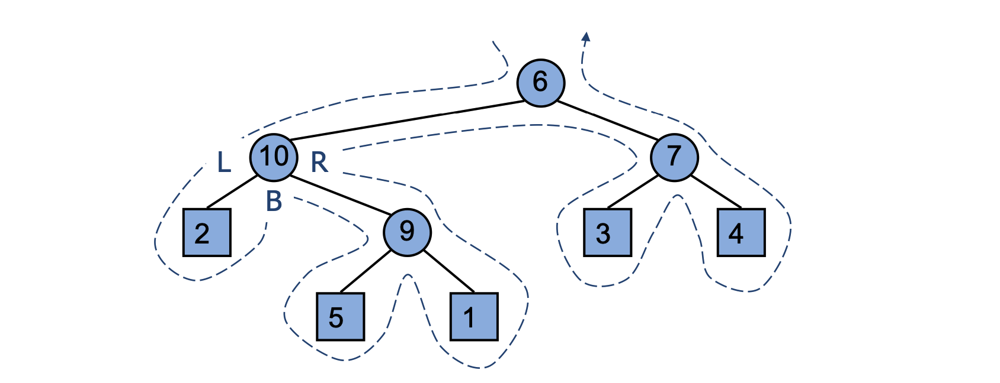

# Euler Tour Traversal

Euler tour is defined as a way of traversing tree such that each vertex is added to the tour when we visit it (either moving down from parent vertex or returning from child vertex).

It is generic traversal of a binary tree. Includes as special cases the [preorder](preorder-traversal.md), [postorder](postorder-traversal.md) and [inorder](binary-trees.md#inorder-traversal) traversals

We start from root and reach back to root after visiting all vertices.

- Preorder (first visit): 6, 10, 2, 9, 5, 1, 7, 3, 4
- Inorder (second visit): 2, 10, 5, 9, 1, 6, 3, 7, 4
- Postorder (third visit): 2, 5, 1, 9, 10, 3, 4, 7, 6