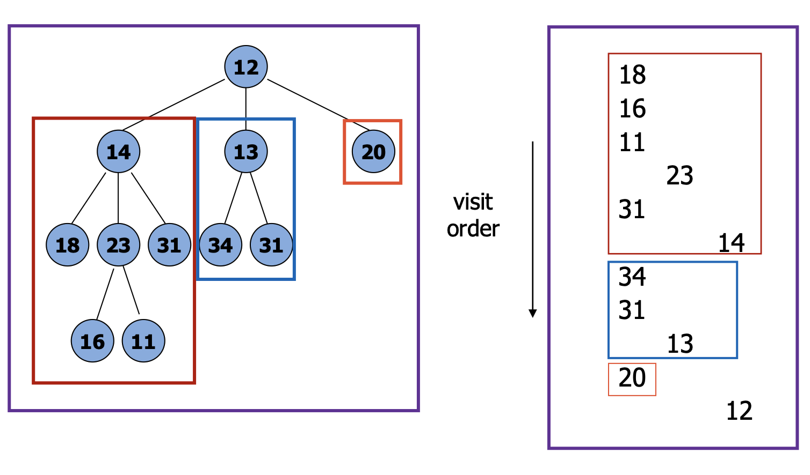

# Postorder Traversal

Postorder traversal is a method of traversing or visiting all the nodes in a tree in the reverse order: visit the left child, then visit the right child, and finally visit the node itself.

Postorder traversal is typically implemented recursively.

## Implementation

To do a postorder traversal starting at a given node, we visit the node after visiting all its descendants

Visit does some work on the node:
- print node data
- aggregate node data
- modify node data

```
def post_order(v):
    for each child w of v:
        post_order(w)
    visit(v)
```

Nodes are numbered in the order they are visited when we call `post_order()` starting at the root node.

## Examples

Example 1:

```
     A
    / \
   B   C
  / \
 D   E
```

The postorder traversal of this tree would visit nodes in the order: D, E, B, C, A.

Example 2:

