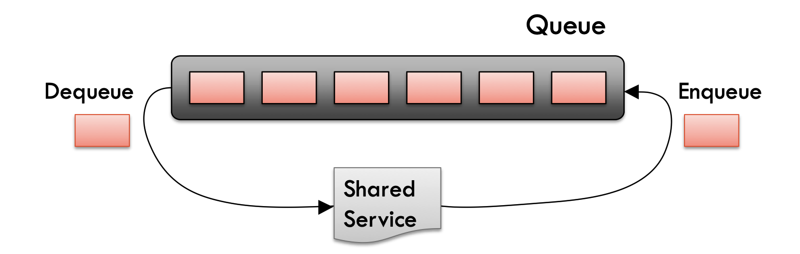

# Queues

A queue is a collection of entities that are maintained in a sequence and can be modified by the addition of entities at one end of the sequence and the removal of entities from the other end of the sequence.

## Operations

Main queue operations:
- `enqueue(e)`: Inserts an element, e, at the end of the queue.
- `dequeue()`: Removes and returns the element at the front of the queue.

Auxiliary queue operations:
- `first()`: Returns the element at the front without removing it.
- `size()`: Returns the number of elements stored in the queue.
- `isEmpty()`: Indicates whether no elements are stored in the queue.

Boundary cases:
- Attempting to execute `dequeue()` or `first()` on an empty queue signals an error or returns null.

### Enqueue Method

The `enqueue()` method adds an element to the end of the queue. If the underlying array is full, we can return an error or dynamically grow the array.

```
def enqueue(e)
    if size = N then
        return "queue full"
    else
        end ← (start + size) mod N
        Q[end] ← e
        size ← size + 1
```

Calculate $(start + size) \mod N$ to determine the correct index for adding a new element.

Ensure that the new element is placed within the bounds of the array, considering the possibility of "wrapping around" when the end of the array is reached.

### Dequeue Method

The `dequeue()` method removes and returns the element at the front of the queue. If the queue is empty, it returns an error or null.
```
def dequeue()
    if isEmpty() then
        return "queue empty"
    else
        e ← Q[start]
        start ← (start + 1) mod N
        size ← (size - 1)
        return e
```

Calculate $(start + 1) \mod N$ to determine the correct index for removing an element.

Ensure that the element to be removed is within the bounds of the array, considering the possibility of "wrapping around" when the beginning of the array is reached.

## Performance

- The space used is O(N)
- Each operation runs in time O(1)

## Applications

Direct applications
- **Waiting Lists, Bureaucracy**: Queues are commonly used to manage waiting lists in various scenarios, such as customer service queues or ticket booking systems.
- **Access to Shared Resources**: Queues provide fair access to shared resources, such as printers or network connections, by allowing entities to wait in line for their turn.
- **Multiprogramming**: Queues are used in operating systems to manage processes waiting for CPU time in a multiprogramming environment.

Indirect applications
- **Auxiliary Data Structures**: Queues serve as auxiliary data structures in various algorithms, such as breadth-first search (BFS) and level-order traversal of trees.
- **Component of Other Data Structures**: Queues are used as components in implementing other data structures, like priority queues and double-ended queues (dequeues).

### Round Robin Schedulers

Implement a round robin scheduler using a queue `Q` by repeatedly performing the following steps:
1. `e ← Q.dequeue()`
2. Service element `e`
3. `Q.enqueue(e)`



This approach ensures fair sharing of resources among processes or tasks by cycling through them in a round-robin fashion.
