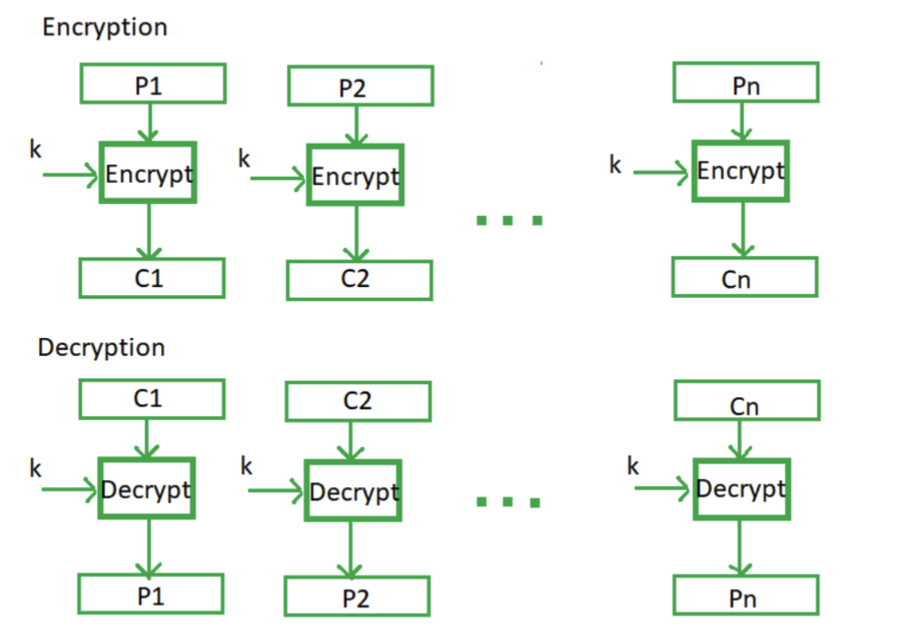
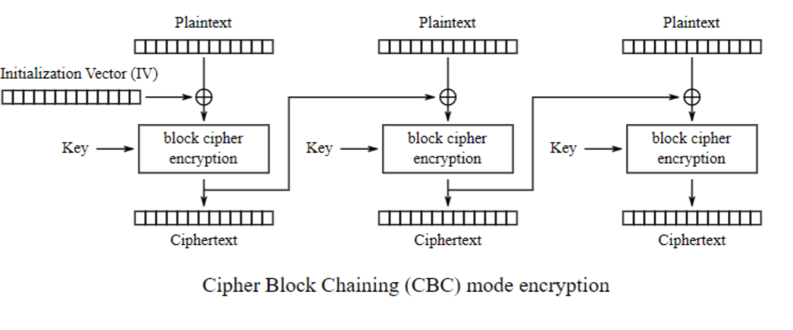

# Block Cipher

Block ciphers are cryptographic algorithms that operate on fixed-length groups of bits, called blocks.

The key is used to determine the mapping between plaintext and ciphertext.

## Block Size

Block ciphers mix chunks of plaintext bits together with key bits to produce chunks of ciphertext of the same size, usually 64 or 128 bits.

Since it is unlikely that the total data will be perfectly divisible by 128 bits, or however large the blocks are, a method called padding is used to ensure that the last block is always complete

Padding is done by adding redundant information to the block to make each block equal in size.

## Implementation

### Electronic Code Book (ECB)

Electronic code book is the easiest block cipher mode of functioning.

It is easier because of direct encryption of each block of input plaintext and output is in form of blocks of encrypted ciphertext.

1. **Single Key Usage**: The same encryption key is applied to each plaintext block independently.
2. **Parallel Encryption**: ECB allows for parallel encryption, as each block is processed independently of the others. This means that the encryption of one block doesn't depend on the results of previous blocks.
3. **Deterministic**: The encryption process is deterministic, meaning that the same plaintext block will always result in the same ciphertext block when encrypted with the same key.
4. **Vulnerabilities**: Despite its simplicity, ECB mode has known vulnerabilities. Identical plaintext blocks will produce identical ciphertext blocks, which can reveal patterns in the data. This lack of diffusion can make ECB susceptible to certain attacks, and it is generally not recommended for secure communications.

### Cipher Block Chaining (CBC)

Cipher block chaining or CBC is an advancement made on ECB since ECB compromises some security requirements.

In CBC, the previous cipher block is given as input to the next encryption algorithm after XOR with the original plaintext block.

In a nutshell, a cipher block is produced by encrypting an XOR output of the previous cipher block and present plaintext block.

It is a sequential process that builds upon previous data blocks.

Plaintext blocks of input data get “chained” to previous output blocks of ciphertext with the use of an initialization vector (IV). And to make the IV more random, it’s XORed prior to the encryption of each input.

Advantage of CBC over ECB is that changing initialization vector (IV) results in different ciphertext for identical message.

On the drawback side, the error in transmission gets propagated to few further block during decryption due to chaining effect.