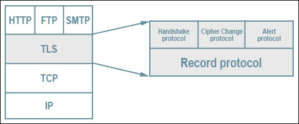

# Transport Layer Security (TLS)

Transport Layer Security (TLS) is a cryptographic protocol that provide [authentications](../authentications/authentications.md) and data confidentiality between servers, machines and applications operating over a network.

[Secure Sockets Layer (SSL)](secure-sockets-layer.md) is an older technology that contains some security flaws. Transport Layer Security (TLS) is the upgraded version of SSL that fixes existing SSL vulnerabilities.

Connection: a transient and live peer to peer communication link, each connection is associated with a session. You can close a connection but keep a session and resume using another connection

Session: a set of states including negotiated parameters. You can renegotiate parameters without interrupting a connection.

## Architecture

