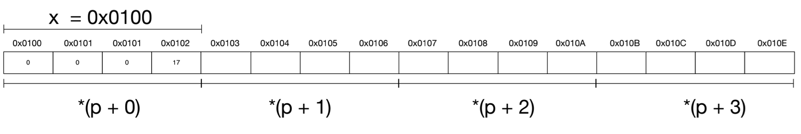
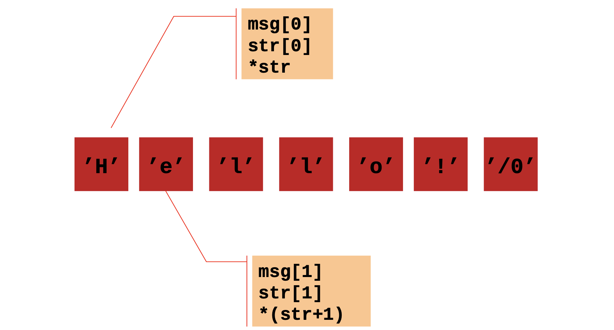

# Pointers

A pointer is a variable that stores the [memory address](../memory-management/memory-address.md) of another variable as its value.

A pointer variable points to a data type of the same type.

A pointer variable takes the memory size depends on the operating system. In a 64-bit integer, a pointer takes 8 bytes as the memory address takes 8 bytes.

## Notation

The indirection operator `*` is used in a variable declaration to declare a “pointer to a variable of the specified type”

```c
int * countp;   // A pointer to an integer
float * amt;    // A pointer (labeled “amt”) to a float.
int ** tricky;  // A pointer (labeled “tricky”) to a pointer to an int
```

## Interpretation

`char *p`
- Address to a single char value
- Address to a single char value that is the first in an array

`char *argv[]`
- Array of "the type" with unknown length
- Type is `char *`

`char **argv`
- `*` Address to the first element to an array of type `char *`

`int **data`
1. Pointer to pointer to single int value
2. Array of addresses that each point to a single int
3. Address that points to one array of int values
4. Array of addresses that point to arrays of int values

## Declearation and Dereferences

```c
int myAge = 43;     // An int variable
int* ptr = &myAge;  // A pointer variable that stores the address of myAge
```

Create a pointer variable with the name `ptr`, that points to an int variable (`myAge`).

Note that the type of the pointer has to match the type of the variable.

```c
// Output the value of myAge (43)
printf("%d\n", myAge);

// Output the memory address of myAge (0x7ffe5367e044)
printf("%p\n", &myAge);

// Output the memory address of myAge with the pointer (0x7ffe5367e044)
printf("%p\n", ptr);
```

Use the `&` operator to store the memory address of the `myAge` variable, and assign it to the pointer.

Now, `ptr` holds the value of `myAge`'s memory address.

```c
// Reference: Output the memory address of myAge with the pointer (0x7ffe5367e044)
printf("%p\n", ptr);

// Dereference: Output the value of myAge with the pointer (43)
printf("%d\n", *ptr);
```

The value of the variable can be get from the pointer points to, by using the `*` operator (the dereference operator).

## Application of Pointers

### Pointer Arithmetic



Seeking to the nth byte from a starting address:

```c
void *get_address(sometype *data, int n) {
    unsigned char *ptr = (unsigned char*)data;
    return (void*)(ptr + n);
}
```

### Arrays

Use of pointer notation to manipulate arrays.

```c
char msg[] = "Hello!";

// The following two lines give the same result
char *str = &msg[0];    // the memory address of the first element
char *str = msg;        // array itself has the address of the first element
```



Pointer notation leads to some shortcuts. For example, moving through a string:

```c
while (*str != ’\0’)
    str++;
```

The previous example may exploit the fact that C treats `0` as `FALSE`:

```c
while (*str)
    str++;
```

### Function Parameters

`void` has no size, but `sizeof(void*)` is the size of an address.

`void*` indicates to the compiler that this pointer references to a data with unknown type. Type casting is then required to use this variable.

### Access Control using Const Keyword

`const` prevents the value being modified. It can be used to help avoid arbitrary changes to memory.

The value const protects depends where it appears.

Case 1:

```c
const char *fileheader = "P1";
fileheader[1] = '3';    // illegal: change of char value
```

In this case, `fileheader` is declared as a pointer to a constant character. This means that the characters pointed to by `fileheader` cannot be modified.

Case 2:

```c
char * const fileheader = "P1";
fileheader = "P3";      // illegal: change of address value.
```

In this case, `fileheader` is declared as a constant pointer to a character. This means that the pointer itself, `fileheader`, cannot be modified to point to a different memory address. However, the value it points to (the string "P1") can still be modified.