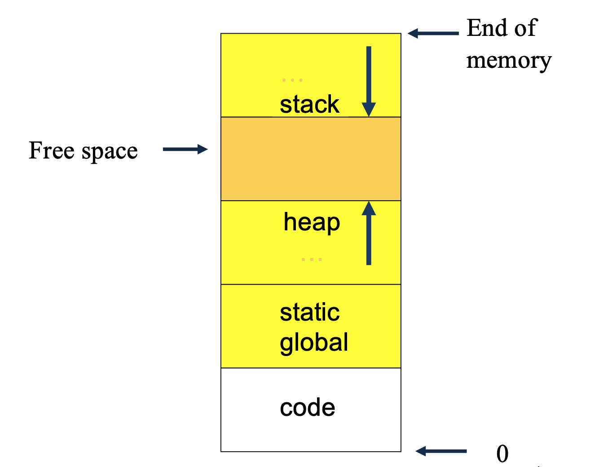

# Memory Structures

## Stacks

In C, all variables local to a function and function arguments are stored on the [stack](../../../computer-architectures/memory.md#stacks).

To call a function the code does:
- `push` arguments onto stack
- `push` return address onto stack
- `jump` to function code

Inside the function, the code does the following:
1. Increment the stack pointer to allow space for the local variables
2. Execute the code  
3. Pop local variables and arguments off the stack push the return result onto the stack  
4. Jump to return address

## Heaps

Memory may be dynamically allocated at run-time from an area known as “the heap”.

Unlike the stack, which meets the temporary storage demands associated with called functions, the heap is accessed under direct programmer control.
